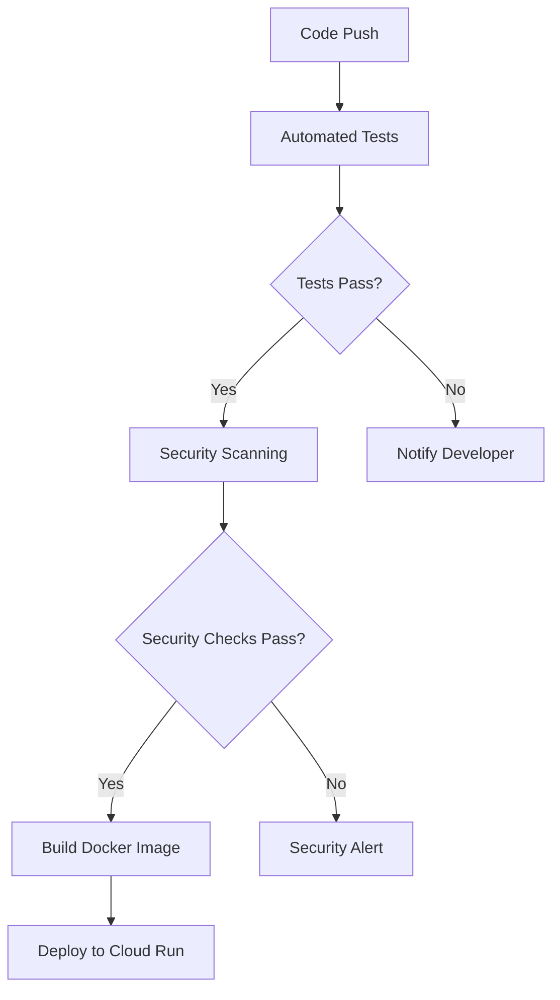

# 🌟 SafeEscape: Your Lifeline in Disasters

<div align="center">
  
)

**Empowering communities with intelligent emergency response solutions**

[](https://flutter.dev/)
[](https://firebase.google.com/)
[](https://nodejs.org/)
[](https://cloud.google.com/)

</div>

## 📋 Table of Contents

- [Project Overview](#-project-overview)
- [The Problem We Solve](#-the-problem-safescape-solves)
- [Key Features](#-key-features)
- [Architecture](#-architecture-overview)
- [Technology Stack](#-technology-stack)
- [Screenshots](#-screenshots)
- [Repositories](#-repositories)
- [Installation Guide](#-installation-guide)
- [CI/CD Pipeline](#-cicd-pipeline)
- [Contributing](#-contributing)
- [License](#-license)
- [Support](#-support)
- [Meet the Team](#-meet-the-team)

## ✨ Project Overview

SafeEscape is a comprehensive disaster management and emergency response system designed to empower individuals and communities during critical times. Built with a focus on real-time information delivery, intelligent guidance, and maximum accessibility, SafeEscape serves as the ultimate safety platform during crises.

> Developed as part of the **GDG SOLUTION CHALLENGE** hackathon, SafeEscape addresses UN Sustainable Development Goal #11: **Sustainable Cities and Communities** by providing robust emergency infrastructure.

## 💡 The Problem SafeEscape Solves

As natural disasters increase in frequency and severity worldwide, the need for effective emergency response systems has never been more critical. Current solutions often suffer from:

- **Fragmentation** across multiple platforms and agencies
- **Delayed updates** during rapidly evolving situations
- **Poor accessibility** in areas with limited connectivity
- **Generic guidance** that fails to account for individual circumstances
- **Complex interfaces** that are difficult to navigate during high-stress situations

SafeEscape addresses these challenges by offering a unified, intelligent, and reliable platform that functions as a lifeline when every second counts.

## 🚀 Key Features

### 🧠 Advanced AI Capabilities

SafeEscape leverages cutting-edge artificial intelligence to deliver:

| Feature | Description |
|---------|-------------|
| **Disaster Prediction** | Uses Vertex AI to analyze patterns in weather, seismic activity, and historical events to predict potential disasters and enable proactive preparedness. |
| **Evacuation Optimization** | Employs AI algorithms to calculate optimal evacuation routes in real-time, accounting for traffic conditions, road closures, and disaster spread patterns. |
| **24/7 AI Assistant** | Provides instant, contextually aware guidance during emergencies when human operators are unavailable or overwhelmed. |
| **Risk Assessment** | Creates personalized risk profiles based on location, infrastructure vulnerability, and historical data. |
| **Natural Language Processing** | Enables the AI assistant to understand and process emergency requests in natural language, even under stressful conditions. |

### 🌐 Real-Time Communication & Connectivity

Maintaining reliable communication during disasters is critical. SafeEscape ensures you stay connected:

- **Bidirectional Communication**: Uses Socket.IO for instant, low-latency messaging between users, backend systems, and emergency responders.
- **Location-Specific Targeting**: Delivers relevant alerts and updates based on your precise location.
- **Multi-Device Synchronization**: Ensures your critical information, emergency contacts, and status updates are available across all your devices.
- **Offline Functionality**: Provides access to critical features like safety guides, first aid instructions, and pre-downloaded evacuation maps even without internet connectivity.

### 🏥 Emergency Response Tools

- **One-Touch SOS**: Instantly alert emergency contacts and nearby responders with your location and situation.
- **Medical ID**: Store critical medical information that first responders can access even when your device is locked.
- **Emergency Resource Locator**: Find nearby shelters, hospitals, police stations, and other emergency facilities.
- **Disaster-Specific Guidance**: Access tailored instructions for different emergency scenarios (earthquakes, floods, fires, etc.).

### 📱 User-Friendly Interface

- **Stress-Optimized Design**: Intuitive navigation and large, clear buttons for use during high-stress situations.
- **Accessibility Features**: Voice commands, high-contrast modes, and screen reader compatibility.
- **Multi-Language Support**: Available in multiple languages to serve diverse communities.
- **Battery Optimization**: Minimal battery usage to extend device life during prolonged emergencies.

## 🏗️ Architecture Overview

SafeEscape follows a modular and scalable architecture that ensures reliability during critical situations:


### Frontend (Mobile Application)

- **Presentation Layer**: Flutter-based UI/UX components with responsive design and offline capability.
- **Domain Layer**: Core business logic and use cases independent of UI implementation.
- **Data Layer**: Repositories managing local storage and API interactions.
- **Core**: Shared utilities, constants, and configurations.

### Backend (Server Infrastructure)

- **API Services**: Node.js/Express handlers for data requests and user information.
- **Real-time Services**: Socket.IO and Google Cloud Pub/Sub for instant communication.
- **Vertex AI Layer**: AI-powered chatbot, evacuation optimizer, and prediction models.
- **External Services Integration**: Weather services, seismic data providers, and mapping APIs.

This architecture ensures maintainability, scalability, and clear separation between the mobile application and the powerful backend services.

## 🛠️ Technology Stack

SafeEscape employs a modern and robust technology stack:

### Frontend
- **Framework**: Flutter & Dart
- **State Management**: Provider
- **Location Services**: Geolocator
- **Local Storage**: SharedPreferences, Hive
- **UI Components**: Material Design, Custom Widgets

### Backend
- **Runtime**: Node.js
- **Framework**: Express.js
- **Real-time Communication**: Socket.IO
- **Messaging**: Google Cloud Pub/Sub
- **Deployment**: Docker, Google Cloud Run

### Cloud Services
- **Authentication**: Firebase Auth
- **Database**: Firebase Realtime Database, Firestore
- **Push Notifications**: Firebase Cloud Messaging
- **Analytics**: Firebase Analytics
- **AI/ML**: Google Cloud Vertex AI
- **Monitoring**: Google Cloud Monitoring, Sentry

### Third-Party APIs
- **Mapping**: Google Maps API (Maps, Geocoding, Directions)
- **Weather**: WeatherAPI, OpenWeatherMap
- **Disaster Information**: IMD API, NDMA API
- **Emergency Services**: 112 India Emergency Helpline Integration

## 📸 Screenshots

<div align="center">
  
  
  
  
</div>

## 🔗 Repositories

This project is split into two main repositories:

- **Frontend (Mobile App)**: [SafeEscape-org/SafeEscape](https://github.com/SafeEscape-org/SafeEscape)
- **Backend (API & Services)**: [SafeEscape-org/SafeEscape-backend](https://github.com/SafeEscape-org/SafeEscape-backend)

## 🚀 Installation Guide

### Prerequisites

Before setting up SafeEscape, ensure you have the following installed:

- Flutter SDK (2.10.0 or higher)
- Dart (2.16.0 or higher)
- Node.js (14.x or higher)
- npm (6.x or higher) or yarn (1.22.x or higher)
- Firebase account with a configured project
- Google Cloud Platform account with necessary APIs enabled
- Google Maps API key

### Step-by-Step Setup

#### 1. Clone the Repositories

```bash
git clone https://github.com/SafeEscape-org/SafeEscape.git
git clone https://github.com/SafeEscape-org/SafeEscape-backend.git
```

#### 2. Frontend Setup

```bash
cd SafeEscape
flutter pub get
```

Then:
- Create a Firebase project and add applications (Android/iOS)
- Download and place your Firebase configuration files:
  - For Android: `android/app/google-services.json`
  - For iOS: `ios/Runner/GoogleService-Info.plist`
- Configure Google Maps API keys in:
  - Android: `android/app/src/main/AndroidManifest.xml`
  - iOS: `ios/Runner/AppDelegate.swift` or `ios/Runner/Info.plist`

#### 3. Backend Setup

```bash
cd ../SafeEscape-backend
npm install
cp .env.example .env
```

Update the `.env` file with your:
- Firebase service account key path
- Google Maps API key
- Google Cloud project configurations
- Other required API keys and configurations

#### 4. Start the Backend Server

```bash
cd SafeEscape-backend
npm run dev
```

The backend server should now be running, typically on http://localhost:3000 (or the port specified in your `.env` file).

#### 5. Run the Frontend Application

```bash
cd ../SafeEscape
flutter run
```

The Flutter app should build and run on your connected device or emulator. Ensure it can connect to the running backend server.

### Common Issues & Troubleshooting

- **Firebase Connection Issues**: Verify your `google-services.json` and `GoogleService-Info.plist` files are correctly placed
- **Google Maps Not Loading**: Check your API key restrictions and enable the necessary APIs in Google Cloud Console
- **Backend Connection Errors**: Ensure the backend URL in the frontend configuration matches your running server

## 🔄 CI/CD Pipeline

The SafeEscape backend utilizes GitHub Actions for a streamlined CI/CD workflow:



Key pipeline components:
- **Automated Testing**: Unit and integration tests run on every push and pull request
- **Security Scanning**: Code analysis to identify vulnerabilities in dependencies and code
- **Continuous Deployment**: Automatic deployment to Google Cloud Run upon successful merges to main branch
- **Monitoring**: Automatic performance monitoring of deployed services

## 👥 Contributing

We warmly welcome contributions from the community! To contribute to SafeEscape:

1. **Fork** the repository you wish to contribute to (Frontend or Backend).
2. **Clone** your forked repository.
3. **Create a branch** for your feature or bug fix (`git checkout -b feature/your-contribution`).
4. **Make your changes**, following our coding standards.
5. **Write tests** for your changes.
6. **Commit** with clear messages (`git commit -m 'feat: Add amazing new feature'`).
7. **Push** to your branch (`git push origin feature/your-contribution`).
8. Open a **Pull Request** to the main branch of the original repository.

### Contribution Guidelines

- Follow the existing code style and conventions
- Write clear, descriptive commit messages following [Conventional Commits](https://www.conventionalcommits.org/)
- Include unit tests for new features
- Update documentation for any changed functionality
- Ensure all tests pass before submitting pull requests

## 📄 License

SafeEscape is distributed under a Custom Proprietary License.

**Copyright © 2025 SafeEscape Team. All rights reserved.**

This software and associated documentation files (the "SafeEscape Emergency Management System") are proprietary. Unauthorized copying, distribution, or modification of this software, or any portion thereof, is strictly prohibited.

For detailed licensing information, please refer to the LICENSE file within each repository.

## ⭐ Support

If you find SafeEscape valuable or are excited about its potential, please give us a star on GitHub! This helps increase visibility and encourages our team.

<div align="center">
  
[⭐ Star the Frontend Repository](https://github.com/SafeEscape-org/SafeEscape) | [⭐ Star the Backend Repository](https://github.com/SafeEscape-org/SafeEscape-backend)

</div>
